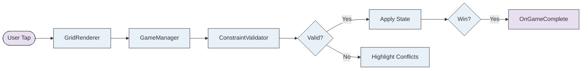

```mermaid
flowchart LR
    classDef startEnd fill:#E8E0F0,stroke:#333,color:#333,stroke-width:1px
    classDef process fill:#E8F0F8,stroke:#333,color:#333,stroke-width:1px
    classDef storage fill:#D8F0E0,stroke:#333,color:#333,stroke-width:1px

    A(["Generate Levels"]):::startEnd --> B["NQueensSolver"]:::process
    B --> C["RegionBuilder"]:::process
    C --> D["UniquenessVerifier"]:::process
    D --> E["LevelData SO"]:::storage
    E --> F["LevelLoader"]:::process
    F --> G["GameManager"]:::process
```

```mermaid
flowchart LR
    classDef startEnd fill:#E8E0F0,stroke:#333,color:#333,stroke-width:1px
    classDef process fill:#E8F0F8,stroke:#333,color:#333,stroke-width:1px

    A(["User Input"]):::startEnd --> B["GridRenderer"]:::process
    B --> C["GameManager.OnCellTapped"]:::process
    C --> D["ConstraintValidator"]:::process
    D --> E["Apply State"]:::process
    E --> F["GridRenderer.UpdateCell"]:::process
    F --> G["UI Render"]:::startEnd
```

> Generated by [**TTADK**](https://bytedance.larkoffice.com/wiki/Gw0ewxEbHi1K0NkVd2YcNwvVnTg) (TikTok AI-Driven Development Kit) brainstorm command

## Involved Projects

| Service (PSM) | Project Path | Change Type |
| --- | --- | --- |
| LinkedIn Queens | New Unity Project | New |

---

## Functional Modules

### Core Game Engine

#### Feature Overview

Implements the N×N crown-placement puzzle logic: grid data models, constraint validation (row/col/region uniqueness + adjacency), game state management with undo/timer, and Auto-X feature.

#### Models

| Change Type | Object | Description |
| --- | --- | --- |
| New | `CellState` enum | Empty, Dot, Crown |
| New | `CellData` class | Position (row, col), state, regionId |
| New | `RegionData` class | RegionId, color, List<Vector2Int> cells |
| New | `GridData` class | Size, CellData[,], List<RegionData> |

#### Validation

| Change Type | Method | Description |
| --- | --- | --- |
| New | `ConstraintValidator.ValidateMove()` | Returns ValidationResult with conflict positions |
| New | `ConstraintValidator.CheckWin()` | Returns bool when puzzle solved |
| New | `ConstraintValidator.GetAllConflicts()` | Returns all violating crown positions |

#### State Management

| Change Type | Component | Description |
| --- | --- | --- |
| New | `QueensGameManager` | MonoBehaviour: moves, undo stack, timer, win detection |
| New | Events | OnGameComplete, OnConflictDetected, OnUndoStackChanged |
| New | Auto-X | Auto-fill dots on crown place, track per-crown for removal |

#### Call Chain

---

### Level System

#### Feature Overview

Procedural level generation with guaranteed unique solutions, LevelData storage via ScriptableObjects, level select UI with 3 difficulty tiers, and progression with unlock logic and star ratings.

#### Level Data

| Change Type | Object | Description |
| --- | --- | --- |
| New | `LevelData` ScriptableObject | LevelNumber, Difficulty, GridSize, Regions, Solution |
| New | `LevelLoader` | Load all assets, GetLevel(), BuildGridFromLevel() |

#### Level Generation

| Change Type | Component | Description |
| --- | --- | --- |
| New | `NQueensSolver` | Backtracking with adjacency constraint, randomized column order |
| New | `RegionBuilder` | Multi-source BFS flood-fill from queen positions |
| New | `UniquenessVerifier` | Tarjan's algorithm for articulation points, border mutation |
| New | `LevelGeneratorService` | Pipeline: Solve → Build Regions → Verify → Create LevelData |

#### Level Select UI

| Change Type | Component | Description |
| --- | --- | --- |
| New | `LevelSelectController` | Tab switching (Beginner/Expert/Impossible), progress bars |
| New | `LevelSelectButton` prefab | State sprites: locked, available, completed |
| New | Progression | Per-tab unlock, first level always available |

#### Call Chain

---

### UI/Rendering

#### Feature Overview

Dynamic grid rendering with region colors and borders, input handling (tap/double-tap/drag), visual feedback (conflict highlight, animations), and victory screen with stats and navigation.

#### Components

| Change Type | Component | Description |
| --- | --- | --- |
| New | `QueensGridRenderer` | Dynamic cell creation, border rendering (thin/thick), crown/dot sprites |
| New | Input Handler | Single tap → cycle, Double tap → crown, Drag → dots |
| New | `VictoryPanel` | Time, moves, star rating, Next Level/Restart/Menu buttons |
| New | `HUDController` | Timer display, move counter, undo/restart/tips buttons |

#### Events

| Change Type | Event | Description |
| --- | --- | --- |
| New | `OnCellTapped` | (row, col) from GridRenderer |
| New | `OnCellDragEntered` | (row, col) from GridRenderer |
| New | `OnGameComplete` | (time, moves) from GameManager |

#### Call Chain

---

### Polish & Extra Features

#### Feature Overview

Audio system with SFX pool and BGM, design system with centralized tokens, tutorial overlay for first-time users, daily challenge with seeded RNG, AdMob monetization, and Firebase analytics.

#### Audio

| Change Type | Component | Description |
| --- | --- | --- |
| New | `AudioManager` singleton | RuntimeInitializeOnLoadMethod, DontDestroyOnLoad |
| New | SFX Pool | 8 AudioSources, no GC during gameplay |
| New | BGM | Fade-in coroutine, volume/mute persistence |

#### Design System

| Change Type | Component | Description |
| --- | --- | --- |
| New | `DesignSystem` static | Color tokens (Primary, Background, Surface), Size tokens, Grid tokens |

#### Daily Challenge

| Change Type | Component | Description |
| --- | --- | --- |
| New | Seeded RNG | Deterministic puzzle by date (same for all players) |
| New | Streak Tracking | PlayerPrefs, reset on skip day |

#### Monetization & Analytics

| Change Type | Component | Description |
| --- | --- | --- |
| New | AdMob | Interstitial (between levels), Rewarded (hint unlock) |
| New | Firebase Analytics | level_start, level_complete, level_fail, ad_watched |
| New | Firebase Crashlytics | Crash reporting |

---

## Risk Points

1. **Level Generation Performance**: 10×10+ grids may require tuning retry/swap parameters in UniquenessVerifier
2. **Android TMP**: TextMeshPro must use Static atlas + pre-baked, `m_ClearDynamicDataOnBuild=0` required
3. **Ad SDK Integration**: AdMob + Firebase require platform-specific setup and test device configuration
4. **Daily Challenge Determinism**: Seeded RNG must produce identical results across Android/iOS (test System.Random behavior)
5. **Memory on Mobile**: Large sprite sheets and font atlases may cause memory pressure on low-end devices

---

## Estimated Scope

| Category | Count |
| --- | --- |
| Scripts | ~50 |
| Scenes | 2 (LevelSelect, Game) |
| Level Assets | 35+ ScriptableObjects |
| Prefabs | 5-10 |
| Sprites | 10-15 |
| Audio Clips | 10-15 |
| Estimated Dev Time | 6-8 weeks |
